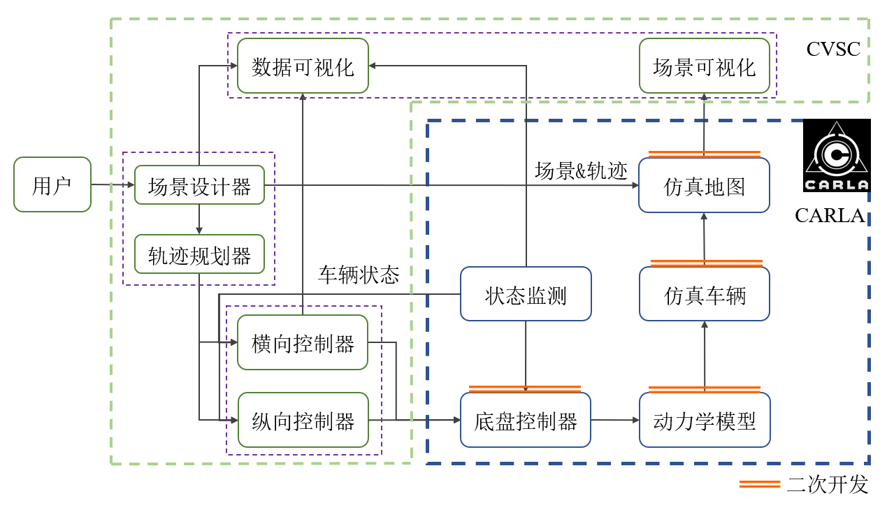
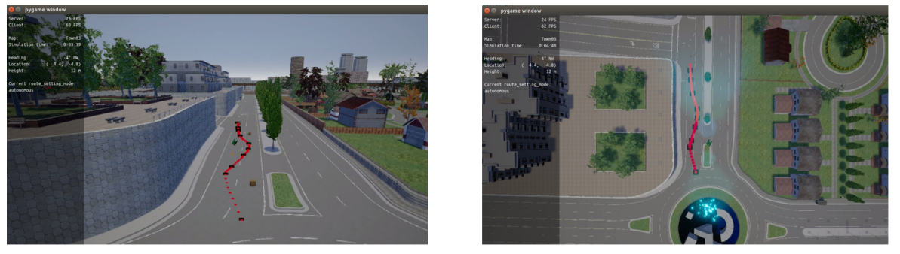
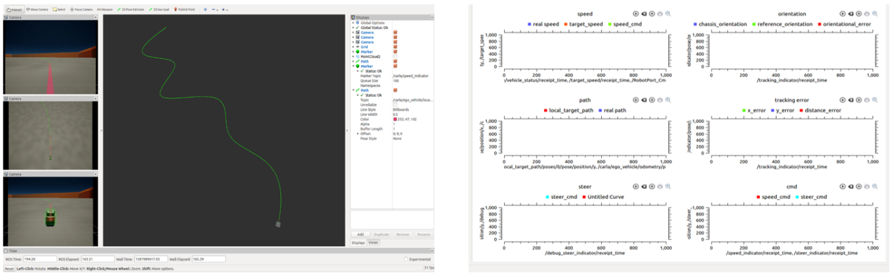
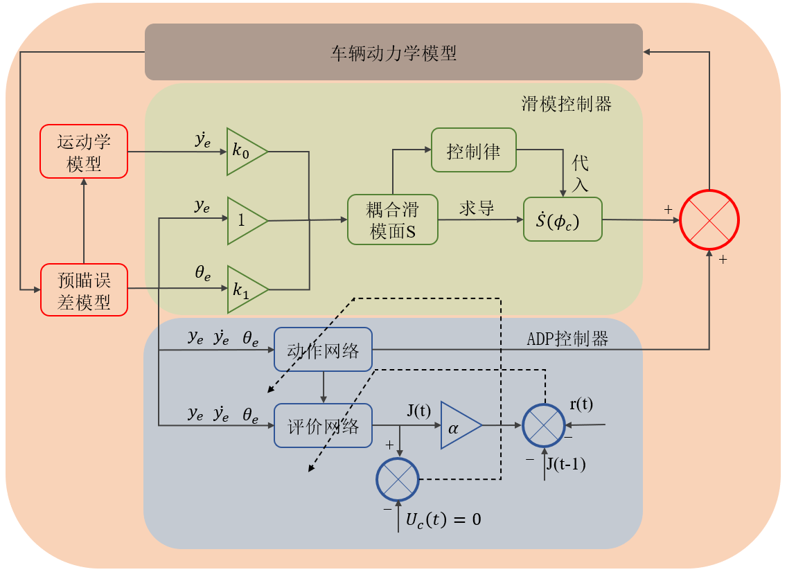
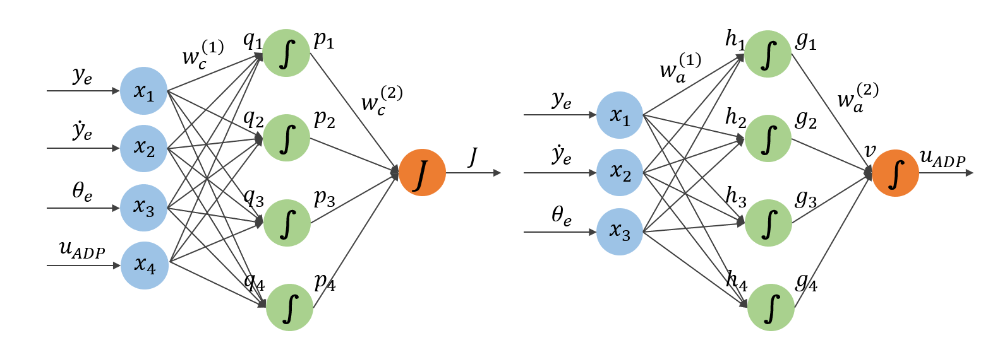
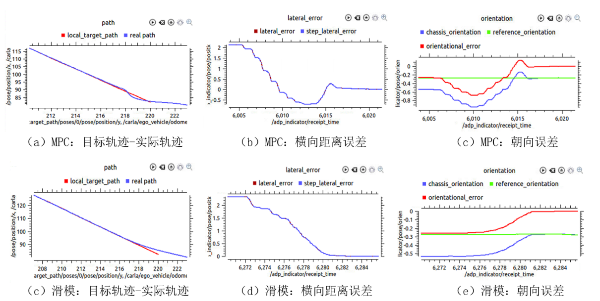

随着人工智能的快速发展，自动驾驶汽车逐渐成为一个研究热点。然而，无人驾驶汽车的昂贵和现场测试的不安全性极大地限制了控制算法的测试。一个方便可靠的仿真器是研究人员开发控制算法的必要条件。本文旨在开发一个基于开源仿真器Carla的虚拟环境下的车辆控制闭环仿真器(CSVC)。在此基础上，提出了横向误差与方向误差耦合的滑模控制算法，并采用自适应动态规划方法提高了跟踪精度。最后，对CSVC仿真平台进行了综合评价，并在CSVC模拟器上验证了所提出的控制算法。

在Carla模块的基础上增加了新的虚拟仿真场景，标定了车辆的动力学模型，改进了新的低阶控制算法。
除CARLA模块外，设计了具有三种插值曲线拟合方法的轨迹规划模块，使用户可以通过可视化操作模拟不同的轨迹，开发了包括仿真动画和仿真数据的可视化模块。该机器人操作系统采用ROS连接控制模块、规划模块、可视化模块和CARLA模块。

针对轨迹跟踪问题，基于自动驾驶汽车运动学设计并实现了控制模块, 并提出了一种结合横向误差和方向误差的滑模控制新算法，保证了横向误差和方向误差收敛到零。本文还尝试使用自适应动态编程(ADP)来提高控制算法的精度，并设计了相应的critic网络结构和action网络结构。

最后，本文从车辆动力学模型、低阶控制器和轨迹规划模块三个方面对仿真平台的可信性进行了评价和验证，标定后的车辆动力学模型非常可靠，低阶控制器性能良好，能准确跟踪所需的车速指令。轨迹规划模块可以非常方便地为用户生成三种不同的轨迹曲线。通过与MPC控制算法的比较，验证了所提滑模控制算法的优越性，并证明了自适应动态规划学习算法能够有效地提高控制算法的性能。
 

