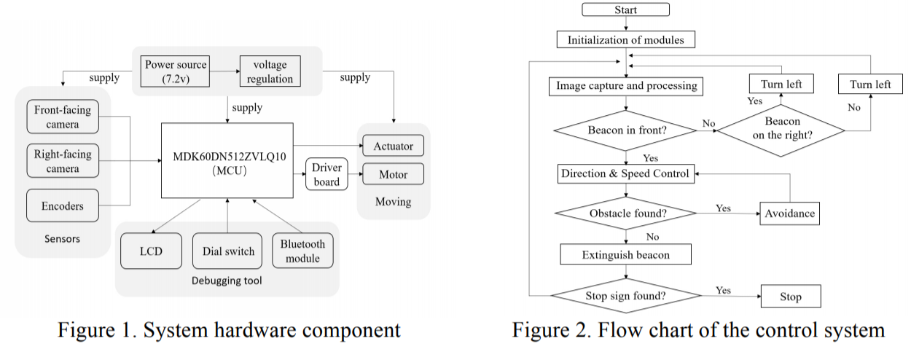
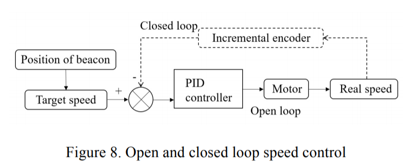
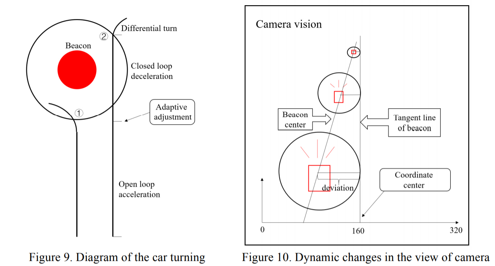

### 简介

近年来，汽车和科技公司不断创新车载电子技术。安全、网络化、智能化是其发展趋势。智能汽车，又称轮式移动机器人，是集环保意识、规划决策、自动化运行于一体的智能汽车。本项目设计了一种基与MDK60(K60)和OV7620摄像头的智能小车，用于照明信标的定向移动。该系统结合了图像识别、速度控制、直线拟合等算法，对智能小车控制具有实际意义。

### 系统架构 
智能汽车系统的微控制器单元(MCU)采用两主从协同的K60。传感器是两个OV7620摄像机和两个增量编码器。前视摄像头获取照明信标和障碍物的位置，右视摄像头在正确区域内搜索照明信标，辅助汽车自主判断方向。编码器用于获取当前的速度和里程。主K60接收并处理完成的图像后，结合从K60信息得到目标速度和目标角度。根据编码器反馈的当前速度，通过脉宽调制(PWM)实现电机速度控制和转向控制，从而实现智能车向发光信标的定向运动。系统采用LCD显示、拨盘开关、蓝牙模块进行调试。液晶显示屏可输出摄像机图像及各种位置参数。拨盘开关用于改变汽车的运行模式，蓝牙模块用于远程控制汽车。根据设计，系统结构图如图1、2所示。

### 速度控制策略

速度控制对于智能车竞赛来说尤为重要。当汽车接近或离开信标、转弯寻找信标、避开障碍物等时，必须经历减速或加速的过程，要求汽车既要稳定又要快速性。开环控制和pid闭环控制是速度控制的经典算法，如图8所示。

在这个智能汽车系统中，它并没有采用简单的PID控制或模糊PID控制，而是将PID控制、开环控制、惯性减速、差动转向等策略相结合，实现自适应控制:加速度过程采用完整的开环控制，当接近信标时,采用PID控制,但减速区间的大小自适应,当启动减速模式后，根据当前速度编码器反馈,使智能车到达灯塔的速度为3.5米/秒,转速控制策略如图9所示。

### 路径规划

